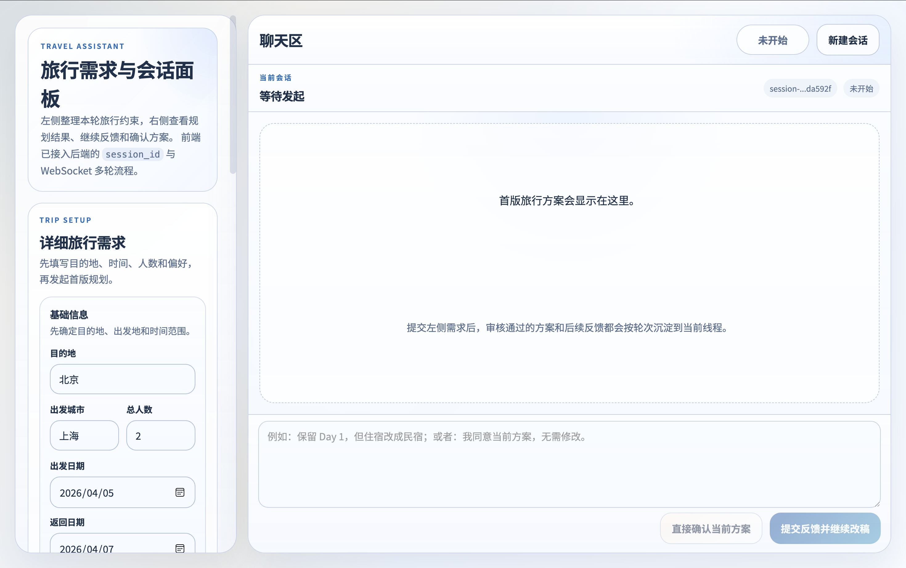
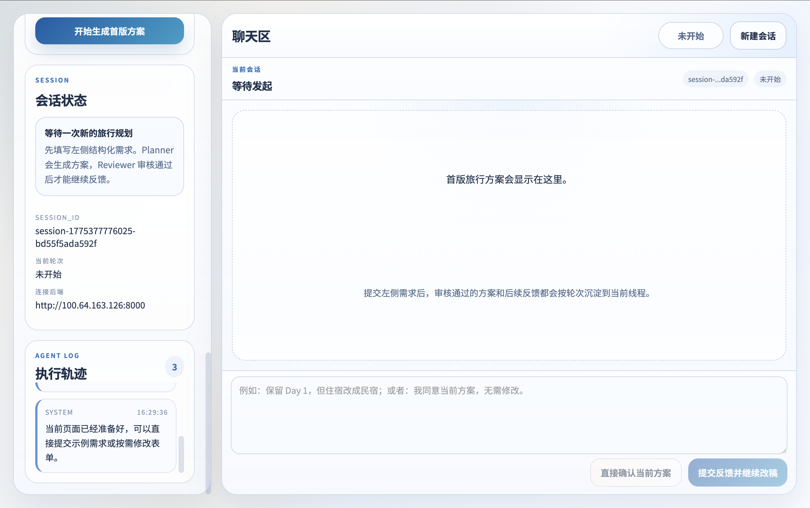

# 智能旅行助手全栈学习实践

基于 AutoGen Swarm 的 Python 命令行脚本，实现的多智能体系统，并将其改造成一个具备现代化 UI 和实时交互能力的全栈 Web 应用，是一个绝佳的边做边学（Learning by Doing）项目。

- planner：负责根据用户输入的旅行需求，调用高德mcp服务，规划出一个合理的旅行方案。
- reviewer：负责审查 planner 的输出，确保方案的合理性和可行性，同时负责和接受用户反馈，进行方案的迭代优化。
- userproxyagent:负责与用户进行交互，收集用户的反馈和需求，并将其传递给reviewer。

下面为你量身定制的实践与学习计划，采用现代主流且极其适合当前架构的前后端技术栈。

## 🛠️ 技术栈推荐 (Modern Tech Stack)

### 1. 后端 (Backend): FastAPI (Python)
- **为什么选它**：你的 AI Agent 逻辑（AutoGen, MCP）是基于 Python 的，且重度依赖异步（`asyncio`）。**FastAPI** 完美支持异步计算，性能极高，同时自带自动化的接口文档（Swagger UI）。
- **主要工作**：将 `旅行助手.py` 从 CLI 脚本重构为一个模块，通过 HTTP 接口或 WebSocket 暴露服务。
- cd backend
- 启动命令：uvicorn app:app --reload --host 0.0.0.0 --port 8000

### 2. 前端 (Frontend): React + Vite (Web App)
- **为什么选它**：React 是目前应用最广的前端框架，Vite 则是当前最流行、超快速的构建工具。它们组合能让你快速掌握现代前端开发范型（组件化、状态管理、Hooks）。
- **样式方案**：**纯 Vanilla CSS (原生 CSS)**。注重掌握现代 Web 美学设计（毛玻璃效果、微动画、丝滑渐变）。
- **主要工作**：构建丝滑的聊天界面交互，解析并渲染来自后端的 Markdown 旅行方案。
- cd frontend
- 启动命令：npm run dev -- --host 0.0.0.0 --port 5173

### 3. 通信协议: WebSocket 
- **为什么选它**：因为你的大模型和 Agent 执行是通过 stream（流式）输出的。为了提供良好的用户体验，前端需要实时看到 Agent 的打字效果和思考过程。

---

## 📅 分阶段实践路线图 (Roadmap)

我们将按照从小到大、从后到前的顺序拆解成 5 个核心阶段。

### 阶段一：后端 API 服务化 (FastAPI 改造)
让你的 Python 脚本能够通过网络接收请求并返回数据。
1. **学习内容**：FastAPI 基础（路由设定、启动 Uvicorn 服务）。
2. **实践任务**：
   - 重构 `旅行助手.py`：将主函数行为封装成可执行函数。
   - 实现一个极简的 POST 接口 `/api/plan`，接收用户文本，返回结果。
   - *(进阶)* 实现 WebSocket 端点，将 Agent 流式输出推送到客户端。

### 阶段二：前端基础框架搭建 (React + Vite)
构建一个能显示在浏览器的交互式前端项目。
1. **学习内容**：Vite 项目初始化，React 基础概念。
2. **实践任务**：
   - 初始化 React 项目，搭建基础脚手架。
   - 划分页面组件：主页面层 -> 对话列表层 -> 消息体渲染组件。

### 阶段三：全栈联调与流式响应渲染
打通前后端，实现真正的"实时打字机对话"。
1. **学习内容**：WebSocket API 通信、状态管理。
2. **实践任务**：
   - 前端连接后端的 WebSocket，发送用户旅行需求。
   - 实时接收后端 AutoGen Agent 运行的思维过程和输出结果。
   - 拼合流式数据并渲染。

### 阶段四：现代美学设计与 UI 优化 (WOW 级体验)
打造一款具有现代感、高级感的 Web 级 SaaS 应用。
1. **学习内容**：现代 CSS 技巧、Markdown 语法解析。
2. **实践任务**：
   - 深度定制 Vanilla CSS 样式（暗黑模式或明亮清晰模式，使用 Google Fonts 如 Inter 字体）。
   - 实现**拟态/毛玻璃（Glassmorphism）设计**制作聊天面板与气泡。
   - 增加**平滑微动画**（元素进入动画、平滑滚动、发送按钮过渡特效等）。
   - 引入 Markdown 渲染库（例如 `react-markdown`），精准渲染旅行行程。

### 阶段五：工程化与拓展功能（后续更新方向）
加入真实应用特有的复杂功能，提升完成度。
1. **持久化存储**：集成 SQLite 保存用户的历史旅游规划。
2. **可视化增强**：结合高德地图前端 API (JS API)，在对话框旁甚至背景里动态展示路线！

### 环境配置：
1. 安装 uv
```shell
curl -LsSf https://astral.sh/uv/install.sh | sh
```
2. clone autogen
```shell
git clone https://github.com/microsoft/autogen.git
cd autogen/python
```

3. 安装依赖
```shell
uv sync --all-extras
```
4. 激活环境
```shell
source .venv/bin/activate
```
5. 安装后端依赖
```shell
pip install fastapi uvicorn
```
6. 前端环境配置
```shell
npm create vite@latest frontend -- --template react
cd frontend
npm install
```
7. .env 配置
需要配置DEEPSEEK_MODEL_NAME;DEEPSEEK_API_KEY;DEEPSEEK_BASE_URL;AMAP_MAPS_API_KEY(高德地图web服务API Key)

## 效果展示




